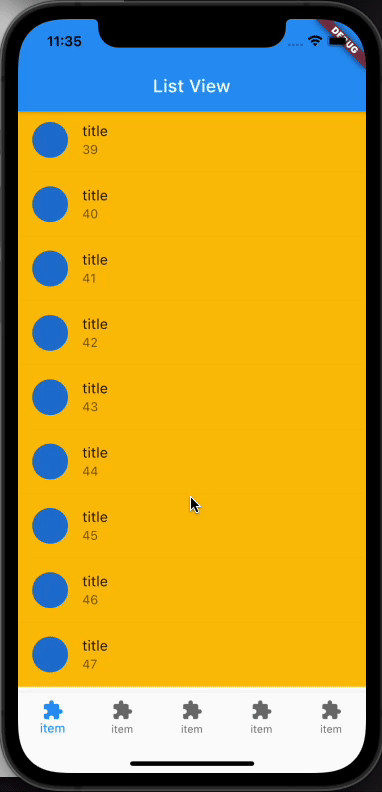

# visibility_detectable_list_view

A sample of list view which detect visibility.

This sample application works like this.


## Getting Started
```
# move to repository
cd /path/to/this/repository

# get dependencies
flutter pub get

# run
flutter run
```

# How to implement?
see [article](https://torikatsu923.hatenablog.com/entry/2021/07/31/000637)